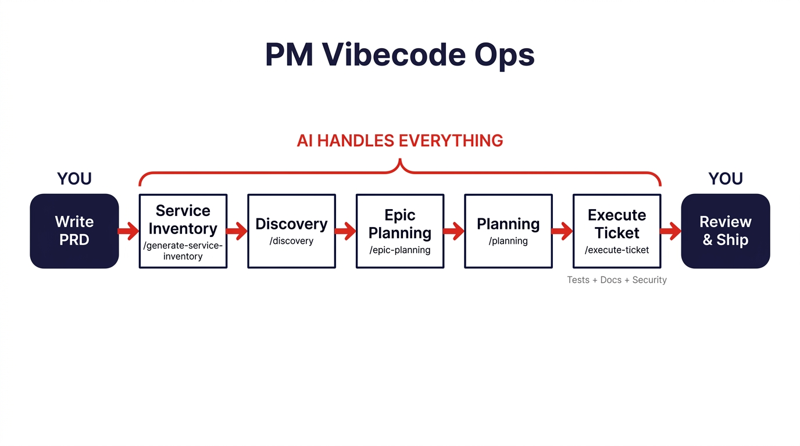

# PM Vibe Code Operations

[](https://creativecommons.org/licenses/by/4.0/)


**A production development workflow for Product Managers who build with AI.**

Write a PRD. Run a few commands. Ship features with tests, documentation, and security review, without waiting for engineering.

We're in the era of personal software, where non-engineers can build real applications with AI. This workflow is the structure that makes it reliable.

---

## AI Coding Without Structure Fails in Specific, Predictable Ways

AI coding tools are powerful enough that non-engineers can build real applications. But without structure, the output breaks down fast:

- **Duplicate functions everywhere.** AI forgets what it built yesterday and recreates the same logic in a different file. You end up with `sendMessage()`, `transmitMessage()`, and `deliverMessage()`, none of them talking to each other.
- **Features that look done but aren't.** AI cheerfully reports "complete" on code that doesn't work. You can't read thousands of lines to verify.
- **Security holes left open.** Authentication without rate limiting. Inputs validated but SQL injection vectors missed.
- **Workarounds hiding bugs.** Try-catch blocks that swallow exceptions. Fallback logic that papers over failures. Technical debt accumulating from day one.
- **Unmaintainable code.** Every change breaks something else. The codebase works just enough to be dangerous.

Workflows like [Superpowers](https://github.com/obra/superpowers) and [gstack](https://github.com/garrytan/gstack) solve this well for engineers. They assume you can read code, debug failures, and make architectural decisions yourself.

**This workflow is for everyone else.** Product Managers, founders, and non-engineers who need production-quality output from AI but can't be their own code reviewer.

---

## AI Needs More Structure Than Human Developers

Human engineers carry context in their heads: what services exist, what patterns the codebase follows, what the team decided last sprint. AI starts fresh every session with zero memory, zero awareness of existing code, and zero quality instincts.

PM Vibe Code Ops provides that structure through discovery, planning, implementation, testing, review, and security, so non-engineers get production-quality results instead of prototypes that collapse under real use.

---

## What's New in 5.0 — Structural Guards, Bespoke Fit

Two complementary upgrades, grounded in a field audit of the largest pm-vibecode-ops deployment (~56 epics) and a mid-2026 recalibration against current frontier models:

1. **Conventions now ship with structural guards.** Field data showed prose rules regress (the most-documented rule regressed four times post-merge; per-surface propagation tickets went 14 opened / 0 closed) while guarded conventions had **zero** regressions. v5.0 adds the **enforcement ladder**: every convention the workflow establishes ships a permanent artifact in your repo — a lint rule, a source-scanning guard test, a drift test, or a shrink-only ratchet — in the same PR. Code review checks it, epic closure gates on it, and CLAUDE.md prose retires to one-line `[enforced:]` pointers as guards ship. The `[prose-only]` count becomes a discipline-debt number you can watch go down.
2. **The toolkit was re-fitted to current models.** Guardrails written for 2024-era model failures (TODO-stubbing, lazy truncation, forgetting to read files) were retired or slimmed — vendors now document that over-prompting *degrades* current models — while the guardrails today's models still need (evidence for every completion claim, scope restraint against over-engineering, anti-reward-hacking, service reuse) were kept and strengthened. The full evidence ledger lives in [docs/MODEL_CALIBRATION.md](docs/MODEL_CALIBRATION.md) and gets re-validated each model generation.

Plus: **`/entropy-audit`**, a recurring cross-epic audit with a machine-diffable scorecard — the codebase health dashboard a non-engineer can read unaided.

---

## What Makes This Different

### AI knows what exists before writing a single line

The **Service Inventory** catalogs your entire codebase before any new code is written. AI sees what's already built, with reuse scores for each service. This prevents the most common AI coding failure: rebuilding functionality that already exists.

### Context engineering over prompt engineering

Most people focus on writing better prompts. The real unlock is giving AI the right context about your project, and making that context inspectable.

Your **ticketing system becomes AI's memory**. Discovery findings, architectural decisions, and implementation guidance are written to Linear or Jira tickets automatically. You can read everything AI knows. You can correct it when it's wrong. The context lives in a system you can inspect, even if you can't inspect the code itself.

### Specialized agents with strict scope boundaries

Instead of one generic AI trying to do everything at once, **11 specialized agents** each handle their phase. The architect creates implementation guidance and never writes code. The backend engineer follows that guidance and never makes architecture decisions. The reviewer catches problems and never adds features. Each agent stays in its lane.

### Security review blocks completion

Tickets don't close until they pass **OWASP + STRIDE + supply chain + CI/CD security review**. This isn't optional. Vulnerabilities block "done." Production readiness is enforced at the workflow level.

### Quality standards enforced during coding

AI loves temporary solutions. This workflow forbids them through **auto-activated quality skills** that enforce production code standards, testing philosophy, and security patterns as code is written. Not in a review step afterward, but during the actual writing.

---

## Who This Is For

**Built for:**
- Product Managers who build with AI tools but keep hitting quality walls
- Technical PMs who want to multiply their output on routine development
- Solo founders building MVPs that need to actually work in production
- Engineering leaders enabling non-technical staff to ship safely

**Best suited for:**
- Internal tools and operational software
- MVPs and prototypes that evolve into real products
- Standard web applications with common patterns
- Features for existing codebases following established conventions

**Bring engineering expertise for:**
- Mission-critical or safety-critical systems
- Highly regulated industries requiring deep compliance review
- Novel architectures or performance-critical systems

---

## The Workflow



One command, `/execute-ticket`, orchestrates the full ticket lifecycle: adaptation, implementation, testing, documentation, two-stage code review, cross-model Codex review, and security review. It creates a PR, pauses only for blocking issues, and marks tickets done when security passes.

For epics with multiple tickets, `/epic-swarm` orchestrates the full workflow across all tickets with dependency-aware sequencing. Each ticket runs the complete 7-phase pipeline (adaptation through security scan) before the next ticket starts — so every ticket's adaptation examines code built by prior tickets. A hard checkpoint verifies all 7 phase reports exist in Linear before any ticket can merge. Dual-layer security review (per-ticket pre-merge + comprehensive post-merge), persistent swarm state for resume, and orchestrator notes for cross-ticket context.

A newer variant, `/epic-swarm-workflow`, runs the same idea as a Claude Code **dynamic workflow** (the JavaScript `Workflow` runtime). It right-sizes each ticket's pipeline to its effort (a planning agent classifies tickets as no-code / small / standard), keeps a hard review floor for any code change, and isolates every subagent failure so a single API hiccup can't abort the run. The whole epic integrates in a dedicated git worktree, so you can run swarms for **different epics concurrently** in one repo without disturbing your checkout, and a merge blocked by new test failures gets a bounded fix-forward pass before it blocks. See [workflows/](workflows/).

---

## Quick Start

### Installation

**Claude Code (recommended):**
```bash
# Add the marketplace
/plugin marketplace add bdouble/pm-vibecode-ops

# Install the plugin
/plugin install pm-vibecode-ops@pm-vibecode-ops
```

Select **"User" scope** when prompted to make it available across all projects.

**OpenAI Codex:** Platform-agnostic prompts in `codex/prompts/`. See [Codex Guide](codex/README.md).

### Prerequisites

- AI coding tool (Claude Code or OpenAI Codex)
- Ticketing system with MCP integration ([Linear](https://linear.app) recommended, [Jira](https://www.atlassian.com/software/jira) and other MCP-integrated systems supported)
- Git repository
- (Optional) [Codex Review MCP Server](https://github.com/bdouble/codex-review-server) for cross-model code review
- [Complete prerequisite checklist](docs/INSTALLATION.md#prerequisites)

### Your First Feature (2-4 Hours)

1. Write a PRD with clear success criteria → [Writing AI-Friendly PRDs](PM_GUIDE.md#writing-ai-friendly-prds)
2. Run project-level commands (inventory, discovery, epic planning, technical planning)
3. Run `/execute-ticket [ticket-id]` for each ticket
4. Merge when all quality gates pass

**Detailed walkthrough:** [GET_STARTED.md](GET_STARTED.md#your-first-feature-2-4-hours)

---

## Realistic Expectations

This workflow helps non-engineers build software that works in production, with proper tests, documentation, and security review.

It will not produce the elegantly architected code that senior engineers write. It will let you ship real features, maintain quality as your application grows, and avoid the unmaintainable mess that unstructured AI coding creates.

AI-assisted development with proper quality gates produces reliable software for many use cases. It does not replace engineering judgment for complex systems. Use this for appropriate projects, and involve engineers when stakes demand it.

---

## Outcomes

**Speed:**
- 50-75% reduction in development time for routine features
- `/execute-ticket` is 8x faster than running phases manually
- Hours-to-days iteration cycles vs. days-to-weeks

**Quality:**
- 90%+ test coverage achievable consistently
- Automated security review catches vulnerabilities before production
- Comprehensive documentation generated automatically
- Code follows existing patterns via service inventory

**Team impact:**
- PMs ship routine features without bottlenecking engineering
- Engineers focus on complex challenges requiring human expertise
- Clear audit trail from requirements to deployment

---

## Complete Workflow Reference

### Project-Level Commands (Recurring)

| # | Command | Purpose | When to Run |
|---|---------|---------|-------------|
| 1 | `/generate-service-inventory` | Catalog existing code | After major codebase updates |
| 2 | `/discovery` | Analyze patterns and architecture | Before each epic planning phase |
| 3 | `/epic-planning` | Create business-focused epics | For each new feature or PRD |
| 4 | `/planning` | Decompose epics into engineering tickets | For each new epic |

### Ticket-Level: Agentic Workflow (Recommended)

**`/execute-ticket [ticket-id]`** orchestrates all phases automatically:
- Creates feature branch using Linear's branch naming
- Gathers parent epic context, referenced documents, and external URLs
- Classifies research briefs as prescriptive or contextual; extracts conformance checklists
- Runs adaptation, implementation, testing, documentation, code review, and security review
- Includes cross-model Codex review between code review and security review
- Two-stage code review: spec compliance gates code quality review
- Creates draft PR after implementation, converts to ready when security passes
- Pauses only for blocking issues (failing tests, security vulnerabilities, conformance gaps)

### Ticket-Level: Individual Phases (Advanced)

For cases requiring phase-by-phase control:

| # | Command | Purpose |
|---|---------|---------|
| 5 | `/adaptation` | Create implementation guide (reuse analysis, pattern selection) |
| 6 | `/implementation` | AI writes production code following guide |
| 7 | `/testing` | Build and fix comprehensive test suite until passing |
| 8 | `/documentation` | Generate API docs, user guides, inline documentation |
| 9 | `/codereview` | Two-stage review: spec compliance then code quality |
| 10 | `/codex-review` | Cross-model adversarial review using OpenAI Codex |
| 11 | `/security-review` | OWASP + STRIDE + supply chain + CI/CD security scan |

### Epic-Level

| Command | Purpose |
|---------|---------|
| `/close-epic` | Close completed epic with the Convention Guard Audit (every pattern the epic established ships a structural guard or an explicit `[prose-only]` tag), deferred work recovery, impact-bar-disciplined follow-ups (≤3), and CLAUDE.md updates with prose pruning |
| `/epic-swarm [epic-id]` | Execute all tickets in an epic sequentially through the full 7-phase pipeline with dependency ordering, hard checkpoints, and dual security review |

### Recurring Maintenance (v5.0)

| Command | Purpose |
|---------|---------|
| `/entropy-audit "<north-star>"` | Cross-epic consolidation audit, run every 3–6 months or N epics: a mechanical census (canonical-pattern coverage, prose-only rule count, guard/ratchet inventory, dead machinery, test-ballast ratios) plus a judgment review with a pragmatism filter, Chesterton's-fence verdicts, a mandatory Leave It Alone list, and one forced highest-conviction change. Emits a machine-diffable scorecard — the codebase dashboard a non-engineer can read unaided. |

### Observability (v4.7, expanded v5.0)

| Command | Purpose |
|---------|---------|
| `/swarm-stats [epic-id-or-ticket-id]` | Render the per-epic or per-ticket workflow dashboard from the 17-event JSONL observability stream — including the v5.0 Discipline Debt section (prose-only vs enforced rule counts, guard-check results, latest entropy scorecard). Backs meta-questions ("are we deferring too much", "did the impact bar help", "what's the codex auto-fix rate"). Pre-v4.7 epics render with a legacy badge. |

### Dynamic Workflow (v4.8)

| Command | Purpose |
|---------|---------|
| `/epic-swarm-workflow [epic-id] [--dry-run] [--push] [--no-push] [--in-place] [--max-tickets N] [--skills a,b,c] [--context-file PATH] [guidance…]` | Run the epic pipeline as a Claude Code **dynamic workflow** (JavaScript `Workflow` runtime). A planning agent classifies each ticket into no-code / small / standard and the script runs a pipeline sized to it; reviews are a hard floor for code changes and fail closed; every subagent failure is isolated so the run always finishes with a reconciled summary; the merge gate uses a test-diff (with a bounded fix-forward pass) so pre-existing/flaky failures don't block clean merges and a cross-file gap can't cascade-kill the epic. The whole epic integrates in a **dedicated git worktree**, so swarms for different epics run concurrently in one repo without touching your checkout (`--in-place` for legacy main-tree mode). `--push` opens the epic PR (default local-only); `--max-tickets N` (N ≥ 1) caps scope; `--skills`/`--context-file`/free-text-after-the-id thread operator guidance into every agent. Requires [dynamic workflows](https://code.claude.com/docs/en/workflows) enabled. Source + delivery notes in [workflows/](workflows/). |

**Best practice:** Run each command in a fresh Claude Code session to prevent context overflow.

---

## Documentation

### For Product Managers

| Guide | Contents |
|-------|----------|
| [PM_GUIDE.md](PM_GUIDE.md) | Complete workflow guide with non-technical explanations |
| [GET_STARTED.md](GET_STARTED.md) | Quick start and navigation |
| [EXAMPLES.md](EXAMPLES.md) | Real-world case studies |
| [FAQ.md](FAQ.md) | 50+ answered questions |
| [GLOSSARY.md](GLOSSARY.md) | Technical terms explained for PMs |

### Technical Reference

| Guide | Contents |
|-------|----------|
| [TECHNICAL_REFERENCE.md](TECHNICAL_REFERENCE.md) | Complete command documentation and architecture |
| [SKILLS.md](SKILLS.md) | Auto-activated quality enforcement details |
| [AGENTS.md](AGENTS.md) | Specialized agent specifications |
| [docs/INSTALLATION.md](docs/INSTALLATION.md) | Comprehensive installation guide |
| [docs/MCP_SETUP.md](docs/MCP_SETUP.md) | MCP configuration (Linear, Perplexity, etc.) |
| [docs/SETUP_GUIDE.md](docs/SETUP_GUIDE.md) | First-time terminal user guide |

---

## Plugin Components

The plugin system automatically provides all components:

| Component | What It Does |
|-----------|-------------|
| **Commands** | 17 workflow phases you invoke (`/adaptation`, `/implementation`, `/execute-ticket`, `/epic-swarm`, `/epic-swarm-workflow`, `/entropy-audit`, `/swarm-stats`, etc.) |
| **Agents** | 11 specialized AI roles (architect, backend engineer, QA, security engineer, entropy auditor, etc.) |
| **Skills** | 16 auto-activated quality standards (production code, security patterns, testing philosophy, observability, etc.) |
| **Workflows** | `epic-swarm-workflow` — a dynamic multi-agent workflow (JavaScript `Workflow` runtime) launched via `/epic-swarm-workflow`; see [workflows/](workflows/) |
| **Hooks** | Session automation for workflow context |
| **Scripts** | `swarm-stats.sh` (observability dashboard) and `validate-skill-invariants.sh` (CI gate for SkillOpt protected regions) |

**Scope options:** User (recommended, all projects), Project (all collaborators), Local (this project only).

---

## Support & Community

- **Questions?** Start with [FAQ.md](FAQ.md)
- **Stuck?** Check [docs/TROUBLESHOOTING.md](docs/TROUBLESHOOTING.md)
- **Issues?** [Open an issue on GitHub](https://github.com/bdouble/pm-vibecode-ops/issues)
- **Contributing?** [CONTRIBUTING.md](CONTRIBUTING.md)

---

## Acknowledgments

Several open-source projects inspired key design decisions in v3.0:

- **[Superpowers](https://github.com/obra/superpowers)** by Jesse Vincent. The skill triggering architecture, two-stage code review, anti-sycophancy protocol, verification intensity patterns, no-placeholders planning rule, and defense-in-depth debugging methodology draw from superpowers' battle-tested skill designs.

- **[gstack](https://github.com/garrytan/gstack)** by Garry Tan. The enhanced security review (attack surface census, secrets archaeology, dependency supply chain audit, CI/CD pipeline security, STRIDE threat modeling, confidence gating) was inspired by gstack's `/cso` Chief Security Officer skill.

---

## License

This work is licensed under a [Creative Commons Attribution 4.0 International License](http://creativecommons.org/licenses/by/4.0/). You are free to share and adapt for any purpose, including commercially, with appropriate credit. See [LICENSE](LICENSE).
